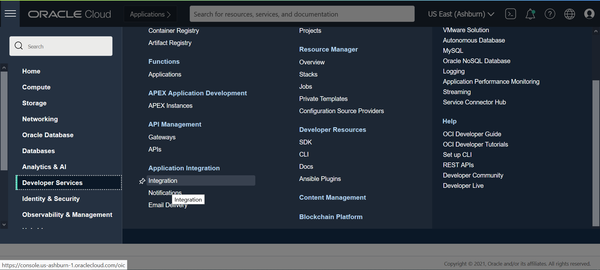
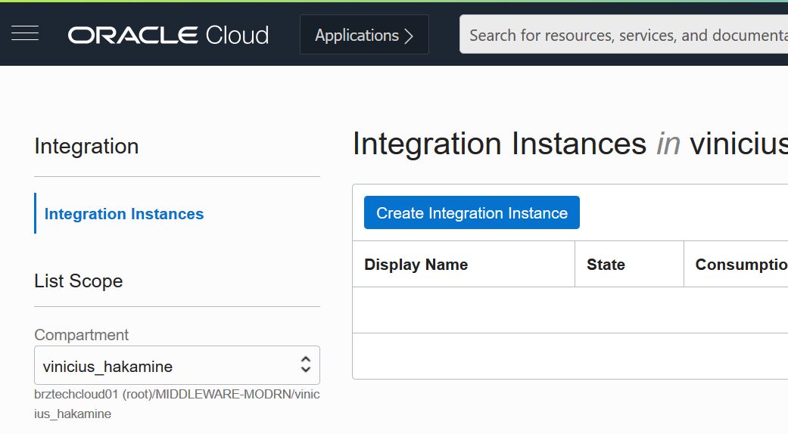
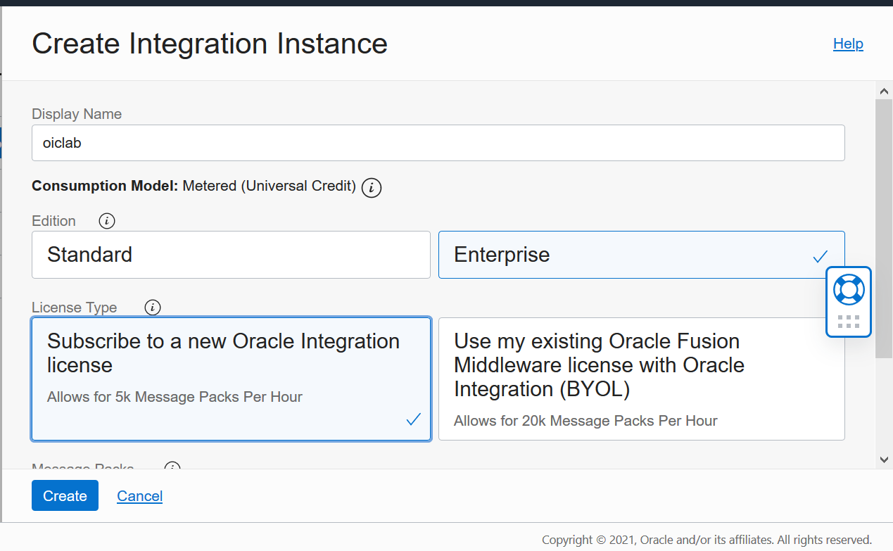

Lab 01 – Criar e provisionar componentes;

1. Logar na console do OCI e acessar o opção **Integration** no menu hambúrguer dentro da categoria Developers Services:

1. Selecionar o compartimento onde provisionaremos os recursos desse laboratório:

1. Clicar em **Create Integration Instance**:

**Display Name**: Escolher um nome para o serviço. Estou utilizando o nome oiclab
**Edition**: Enterprise
**License Type**: Subscribe to a new Oracle Integration license
**Message Packs**: 1

1. Clique em **Create**;
1. Aguarde a conclusão do provisionamento;

