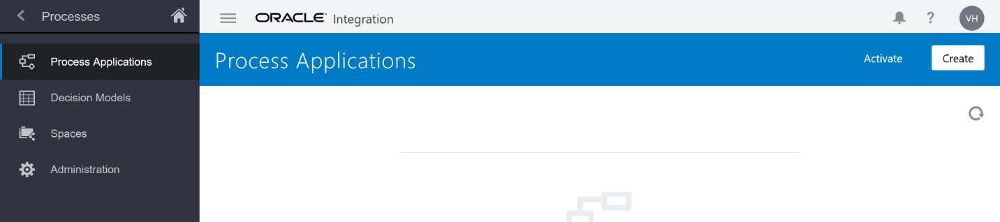
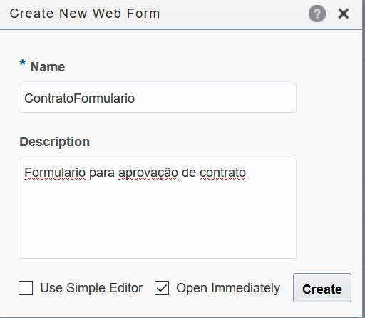
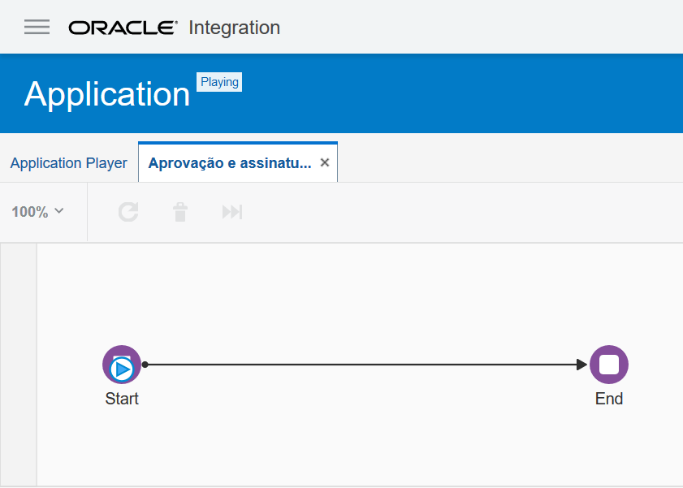
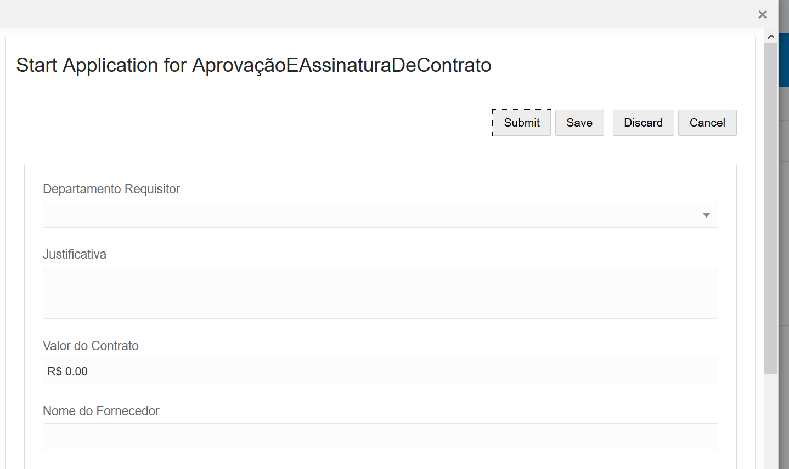

Lab 03 – Criar Aplicação de Processos no OIC;

1. Acessar a home do OIC:
   
1. Clicar no botão de menu **hambúrguer** e clicar na opção **Processes:**
   
1. Clicar na opção **Process Applications**:
   
1. Clicar no botão **Create:
   **
1. Selecionar a terceira opção **Create an Application:
   **
1. Clicar em **Create:
   **
1. Agora vamos preencher os dados da nossa aplicação com as informações abaixo:
   Name: Application (Escolher o nome da sua aplicação, no material estamos usando o nome Application)
   
   Space: [New Space] (Selecionar a opção New Space)
   
   New Space: **[Preecher seu nome]**
   
   Description: Aplicação de assinatura de documentos do hands on.
   
   Open Immediately: Marcado
   
1. Com as informações preenchidas, o seu formulario deve estar como o da imagem abaixo:
   
1. Clicar no botão **Create** (Em azul\*);
1. Agora que nossa aplicação está criada vamos criar nosso primeiro fluxo de processo automatizado;
1. Vamos clicar no botão **Create a Structured Process**:
   
1. Vamos escolher a opção **Start from a form:**
1. Vamos preencher com as seguintes informações:
   **Name**: Aprovação e assinatura de contrato
   
   **Description**: Processo de aprovação e assinatura de contrato.
   
   Select a Pattern: Form (Start with a form)
   
   
1. Clicar em **Create**;
1. Agora que nosso processo foi criado com sucesso, vamos criar e associar um formulário ao início do nosso processo;
1. Clicar no objeto **Start**,** em seguida clicar no ícone de menu que apareceu ao lado direito do objeto, em seguida clicar na opção **Open Properties**:
   
1. Agora vamos preencher com as seguintes informações (utilizar os mesmos valores do exemplo abaixo):
   
   **Title**: Aprovação e Assinatura de contrato
   
   **Description:** Processo de aprovação de contratos, uma vez que o contrato esteja aprovado o mesmo é enviado para assinatura digital.
   
   
1. Clicar no botão **+** para criar um novo formulário e associá-lo ao nosso processo;
1. Preencher conforme a imagem abaixo:
   
1. Clicar no botão **Create**;
1. Criar um campo no formulário arrastando um objeto **Select** e nomeá-lo como area:
   
1. Agora clique sobre o objeto **Select** dentro do formulário e utilize o scroll nas **Properties** para encontrar **Option Source**, configure conforme a imagem abaixo**:
   **
1. Utilize o scroll nas **Properties** e vamos mudar as propriedades **Name** e **Label** com os valores iguais da imagem abaixo:
   
1. Agora vamos arrastar um **Input Text** para colocar o nome do fornecedor, da mesma forma que configuramos o Select vamos mudar o **Name** e **Label** para os valores:
   
   **Name**: fornecedor
   
   **Label**: Nome do Fornecedor
   
   
1. Adicionar um Objeto do tipo **Money**, para definir o valor do contrato, configurar as Properties com os seguintes valores:
   
   **Name**: valor
   
   **Label**: Valor do Contrato
   
   **Currency**: Brazilian Real (BRL)
   
   **Min**: 0
   
   
1. Agora vamos colocar um objeto do tipo **Text** para um breve resumo do que se trata o contrato, preencher as **Properties**, com os valores abaixo:
   
   **Name**: descricao
   
   **Label**: Descrição do contrato
   
   
1. E agora, por último, vamos incluir um campo para colocar a justificativa de porque devemos assinar esse contrato. Vamos utilizar novamente um objeto do tipo **Text** com **Name** e **Label** com os valores abaixo:
   
   **Name**: justificativa
   
   **Label**: Justificativa
   
1. Agora que terminamos o formulário vamos clicar no botão **Save**.
1. Podemos utilizar o botão **Preview** para ver como o nosso formulário sera visualizado em um dispositvo smartphone, tablet, laptop, etc;
1. Clicar no botão de fechar na aba do nosso formulário (ContratoFormulario):
   
1. Clique no botão **Test** para testar nosso processo;
1. Em seguida vamos clicar em **Activate**:
   
1. Garantir que a opção **Add me to All Roles** esteja marcada e clicar em **Activate**:
   
1. Clicar em **Play** para testarmos:
   
1. Clicar no ícone com o nome do nosso processo **Aprovação e Assinatura de Contrato**:
   
1. Agora iniciar nosso teste clicando no ícone Play em **Start**;

1. Neste momento vamos conseguir iniciar o nosso processo preenchendo o nosso formulário, após isso o processo será encerrado. Devemos preencher com dados valídos, não esquecendo de fazer o upload de um contrato e clicar em **Submit**;
   
1. Abaixo o screenshot do resultado esperado. Ver a trajetória do nosso processo:
   
1. FIM;

[Clique aqui para voltar a lista de labs](https://github.com/vhakamine/OIC_HANDS_ON/blob/main/README.md)
