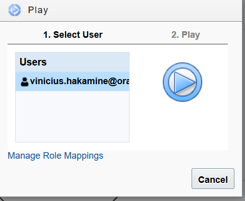
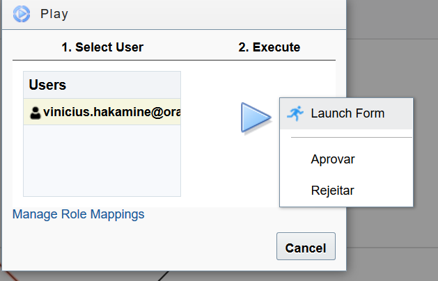

Lab 04 – Criar e associar atividades no processo;

1. Em Processes, acesse a funcionalidade **Process Applications**:
   
1. Abrir **Application**, a aplicação que estamos trabalhando;
1. Vamos abrir o processo **Aprovação e assinatura de contrato**;
   
1. Vamos criar uma nova **Lane** (Raia), para que o processo roteie a atividade para o jurídico aprovar o contrato, clique no Ícone **+** para criar a nova raia:
   
1. O nome da Lane ficou como **Proccess Owner:
   **
1. Vamos modificá-la para **Juridico**. Clicar em cima da **Lane** para que fique azul e clicar no ícone do **Lápis**:
   
1. Agora vamos clicar no ícone **+** para criar uma nova Role na ferramenta que irá representar o departamento **Jurídico:**
   
1. Preencher com **Juridico** e clicar em **Ok**:
   
1. Agora vamos clicar no botão com a seta para baixo acima do ícone com **?** ao lado direito:
   
1. Vamos arrastar um objeto **Approve** do tipo **Human**. Isso vai fazer com que nosso processo seja aprovado pelo departamento Juridico da nossa companhia:
   
1. O objeto deve ficar posicionado entre os objetos de **Start** e **End** do projeto, conforme a imagem abaixo:
   
1. Em seguida arraste o objeto **User task**, para a **Lane (Juridico)**:
   
1. Clicar no objeto **User task**, depois clicar no ícone de **menu** abaixo do ícone de **seta,** clicar em **Open Properties:
   **
1. Vamos clicar no Ícone **Lupa** para selecionar o formulário que já haviamos criado anteriormente para esse processo. Selecionar e clicar em **Ok**:
   
1. Em **Action,** vamos renomear as ações de **APPROVE,REJECT** para **Aprovar,Rejeitar**:
   
1. Agora vamos customizar o Title, Task Summary, Due Date, Priority, Skip Approval On:

   **Title**: Titulo da Atividade de aprovação, estou utilizando: **"Validar contrato com o Forcenedor: " + ContratoFormulario.fornecedor + " no valor de " + ContratoFormulario.valor** , no qual o **nome do fornecedor** e **valor** estamos pegando o valor dinamicamente do formulário

   **Task Summary**: Resumo da atividade, normalmente é descrito o que deve ser executado nessa atividade, estou usando o valor: Verificar clausulas e legalidade do contrato;
   
   **Due Date**: Tempo de SLA para conclusão da aprovação, estou usando o valor de 7 dias corridos: 0M7d0h0m;
   
   **Priority**: Prioridade da atividade, neste caso estou utilizando Normal;
   
   **Skip Approval On**: Utilizado quando temos diversos aprovadores para a mesma atividade modelo serial ou paralelo, por exemplo se é negado por um aprovador os outros não precisam avaliar por já está reprovado! Estou utilizando como desmarcado
   
   
1. Usar o ícone de seta para baixo para ocutar as **Properties** do **User Task,** clicar duas vezes no User Task para renomear a atividade para **Aprovação Departamento Juridico**:
   
1. Clicar em **Save** e testar o processo clicando em **Test** e depois no ícone **Play**:
   
1. Clique no ícone Play no **Start** para testarmos nosso processo:
   
1. Selecionar o usuário e clicar em **Play**:
   
1. Preencher o Formúlario e clicar em **Submit**:
   
1. Após preencher o formúlario e anexar o contrato, o processo fez o roteamento para o time Juridico fazer a aprovação desse contrato, como podemos ver na imagem abaixo:
   
1. Clicar no ícone de **Play** na Aprovação do Departamento Juridico, verificar se todos os dados da Atividade estão respondendo conforme o esperado, por exemplos os valores dinamicos do Titulo da Atividade, selecionar o usuário e clicar no botão **Play**:
   
1. Escolher a opção **Launch Form** para verificar todas as informações:
   
1. Aprovar ou Rejeitar;
1. Verificar a execução do fluxo até o final e clicar em **Close**;
1. Fazer um novo teste desde o inicio voltar ao passo 18 executar o teste com a opção não utilizada ainda caso você escolheu **Aprovar** no passo 25 utilizar **Rejeitar**;
1. Clique em **Save** para salvar nosso progresso;
1. Fim;

[Clique aqui para voltar a lista de labs](https://github.com/vhakamine/OIC_HANDS_ON/blob/main/README.md)
