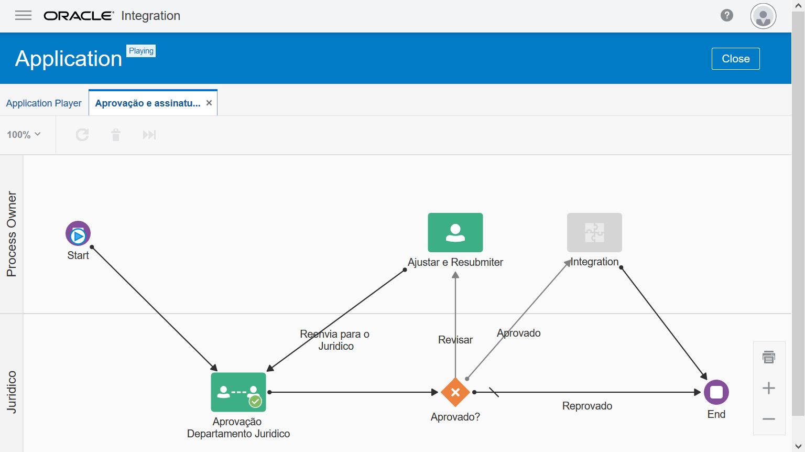

Lab – Adicionar complexidade utilizando gates e human taks;

1. Acesse o nosso processo:
   
1. Vamos configurar a Tarefa de aprovação para solicitar ajustes, clicar sobre a **Aprovação Departamento Juridico** e em seguida clicar no ícone de **menu**:
1. Clique em **Open Properties:**
1. Vamos adicionar uma terceira ação **Revisar** o pedido:
   
1. Agora vamos inserir um **Gateway** do tipo **Exclusive** para definir caminhos diferentes baseados na aprovação do **Juridico:
   **
1. Arrastar o objeto **Exclusive** da paleta para o fluxo de processo depois da tarefa de **Aprovação**:
   
1. Agora vamos adicionar a condição de que se o time **Juridico** responder **Revisar** vamos enviar de volta para quem abriu a requisição ajustar e/ou responder os questionamentos do **Juridico**, para isso vamos pegar um objeto **Submit** e arrastar para o fluxo na **Lane** **(raia) Process Owner**:
   
1. Agora vamos renomear para **Ajustar** e **Resubmiter**:
   
1. Agora vamos clicar no **Exclusive Gateway** e em seguida clicar no ícone de seta para ligar **Exclusive Gateway** com o **Ajustar e Resubmiter** quando a resposta do **Juridico** for **Revisar**:

   
1. Arrastar a seta até o objeto **Ajustar e Resubmiter**:
   
1. Clicar duas vezes em cada uma das seta para descrever cada um dos caminhos como foi feito na imagem abaixo:
   
1. Configurar o objecto **Submit (Ajustar e Resubmiter)**, clicar no objeto **Submit** e depois vamos clicar no ícone **menu** e em seguida em **Open Properties**:
   
1. Clicar no Ícone **Lápis** em **Assignee(s)** e marcar a opção **Creator (the user who started the process)** e clicar em **Ok:
   **
1. Clicar no ícone da **Lupa**, em Form, e selecionar o **Formulario** que já estavamos utilizando **(ContratoFormulario)**. Clicar em **Ok**:
   
1. Em Action renomear para **Resubmiter**:

   
1. Preencher o **Title** para: Revisar e seguir as orientações do Juridico;
1. Preencher o **Task Summary** para: Revisar os comentários do Juridico e prover as respostas solicitadas.
1. Não preender o **Due Date**, não iremos impor um SLA;
1. Deixar a **Priority** como Normal;
   
1. Agora vamos ligar a atividade **Ajustar e Resubmiter** para **Aprovação Departamento Juridico**, clicar na atividade em seguida clicar no ícone **seta** e ligar com o objeto **Aprovação Departamento Juridico:
   **
1. Agora que todas as setas estão nomeadas vamos configurar a condição para cada uma delas, clicar na seta **Revisar** e em seguida clicar no ícone do **Lapís**:
   
1. Clicar no ícone do **Lápis** para editarmos a condição, colocar a seguinte condição:

|TaskOutcomeDataObject = "Revisar"|
| :- |

1. Clique em **Validate**, para garantir que a expressão é valida;
1. Vá ao final da pagina e clique em **Ok**:
   
1. Ao final nossa configuração, esta deve estar similar a da imagem abaixo:
   
1. Vamos configurar um objeto **Integration** para implantarmos nos próximos labs, arrastar ele da paleta para o fluxo:

   
1. Clicar no objeto **Integration** e, em seguida, clicar no ícone menu e em **Open Properties**:
   
1. Marcar a opção **In Draft**: 
   
1. Clicar no objeto **Gateway** em seguida no ícone **seta** para ligar o Gateway com o objeto **Integration**:

   
1. Renomear a seta para **Aprovado**;

1. Clicar na seta **Aprovado** em seguida clicar no ícone Lápis para editar a condição:
   
1. Configurar a seta Aprovado da mesma maneira, porém com a condição abaixo:

|TaskOutcomeDataObject = "Aprovar"|
| :- |
1. Agora vamos clicar duas vezes no nome do objeto **Integration** e vamos renomeá-lo para **Assinatura Digital**: 
   
1. Agora clicar no objeto **Assinatura Digital** em seguida clicar no ícone seta e fazer a ligação com o objeto **End**:
   
1. Agora iremos clicar no botão **Play** para testar o processo e verificar se tudo se comporta da maneira que esperamos:
   
1. Clicar no botão **Play** para testar, utilizar todos os cenários possíveis (Aprovar, Rejeitar e Revisar):
1. Fim

[Clique aqui para voltar a lista de labs](https://github.com/vhakamine/OIC_HANDS_ON/blob/main/README.md)
