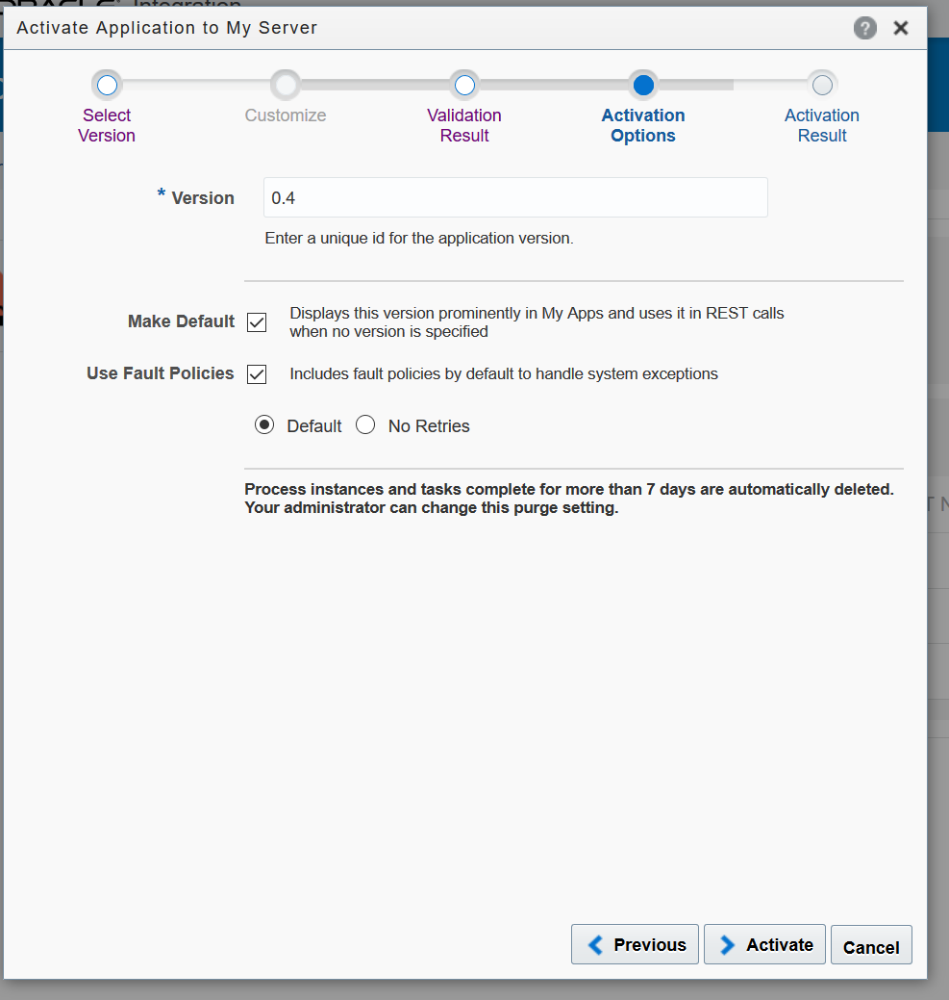

Lab – Integrar banco / assinatura de documentos digitais com docusign

1. Acesse a console do OIC;
   
1. Acessar menu hamburguer -> Processess;
1. ` `Clicar em Process Application;
   
1. Em seguida vamos clicar em **Application** a aplicação de processos que estamos trabalhando:
1. Primeiro vamos clicar em **Publish** para publicar nossa aplicação;
   
1. Preencha um comentário sobre porque estamos publicando nosso processo:
   
1. Clique em no botão **Publish**:
   
1. Uma vez que nosso processo está publicado vamos clicar em **Activate** para aviva-lo:
   
1. Clicar no botão **Active new version**:
   
1. Deixar selecionada a opção **Last Published Version** e clicar em **Validate**:
1. Com a mensagem de sucesso **Application successfully validated!, c**licar no botão **Options**:
   
1. Colocar um número para representar a versão da minha aplicação de processos, estou utilizando o valor 0.4 já que não é a primeira vez que estou ativando uma versão em produção;
   
1. Marcar as opções como na imagem acima e clicar no botão **Activate**;
1. Aguardar o resultado da ativação
1. Ao receber a mensagem de sucesso **Application successfully activated!** clicar no botão Finish;
   
1. A versão ativada será exibida como a **Latest activated: version XXX**:
   
1. Com a nossa aplicação publicada vamos configurar as atores de cada das Lanes;
1. Para simplicar vamos colocar nosso usuário em todos os papeis;
1. Acessar o menu hamburguer do OIC clicar no ícone **Home**;
1. Novamente acessar o menu hamburguer e clicar em My tasks;
   
1. Agora clicar em Administration;
1. Clicar na opção Manage Roles:
   
1. Usar a Barra de pesquisa com o nome da nossa aplicação de processos **Application** e pressionar **enter** ou clicar no **botão de busca**:
   
1. Clicar na Role **Application.Process Owner**, e  clicar no botão **Add Member**:
   
1. Inserir o e-mail que é utilizado como Login do OIC;
   
1. Marcar o checkbox e clicar no botão **Ok**;
   
1. Clicar no botão **Save** e receber a mensagem de sucesso:
   
1. Vamos fazer os mesmo passos com a Role: **Application.Juridico**
1. Testar em processo publicado;
