Lab06 - Criar Integração

1. Logar no OIC acessar o menu hamburger e clicar na opção **Integration**:

   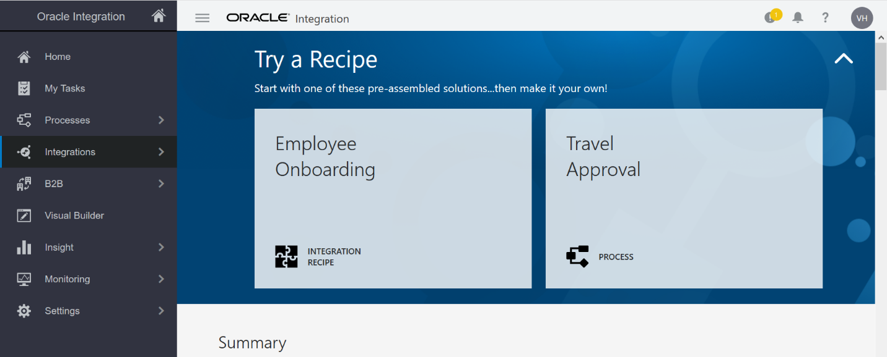
   
1. Clicar no menu hamburger em seguida clicar em **Integrations**:

   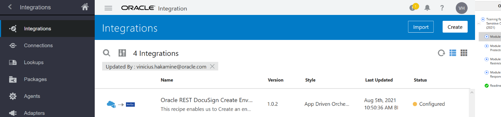
   
1. Clicar no botão **Create**;
1. Clicar em **App Drive Orchestration** e no botão **Select**:

   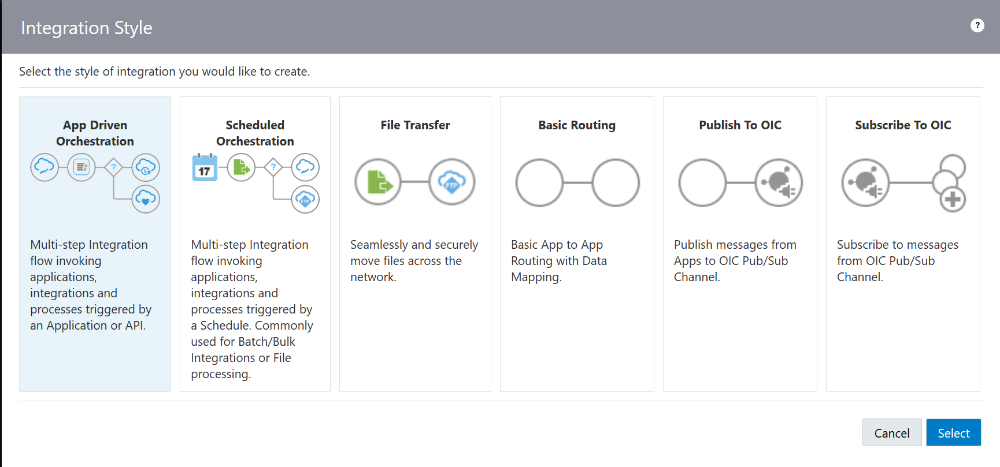
   
1. Preencher conforme a orientação abaixo em seguida clicar no botão **Create**:

   Name: [MYNAME]\_ASSINATURA\_DIGITAL (MYNAME entre colchetes substituir pelo seu nome);
   
   Identifier: [MYNAME] \_ASSINATURA\_DIGITAL (Será preenchido automáticamente de acordo com o Name);
   
   Version: 01.00.0000 (Preenchido automáticamente);
   
   Documentation URL: Não preencher. É possível apontar uma documentação existente;
   
   Keywords: Você pode preencher com keywords para que depois você as utilize para relacionar, estou utilizando o valor com o meu nome;
   
   Package: Não preencher, é possível montar pacotes para cada uma de suas sprints;
   
   Description: Descrição do desenvolvimento, estou usando o valor: Enviar contrato para assinatura digital.
   
   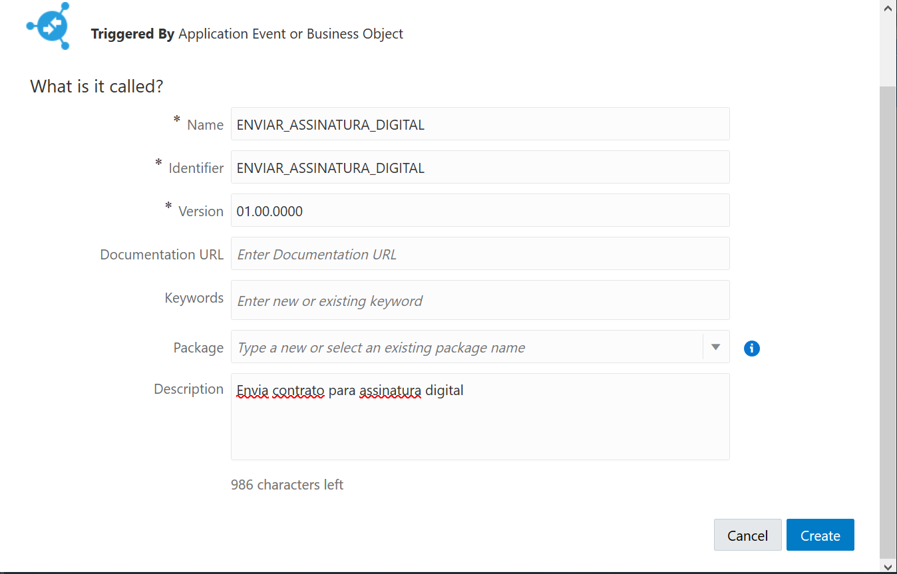
   
1. Clicar no botão **+** conforme a imagem abaixo:

   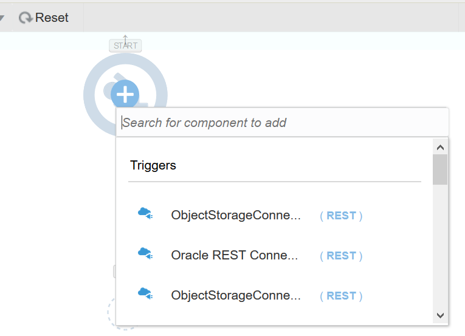
   
1. Buscar e clicar na conexão **[MYNAME]\_REST** que criamos nos laboratórios anteriores;
1. Preencher as informações conforme a imagem abaixo e clique em **Next**:

   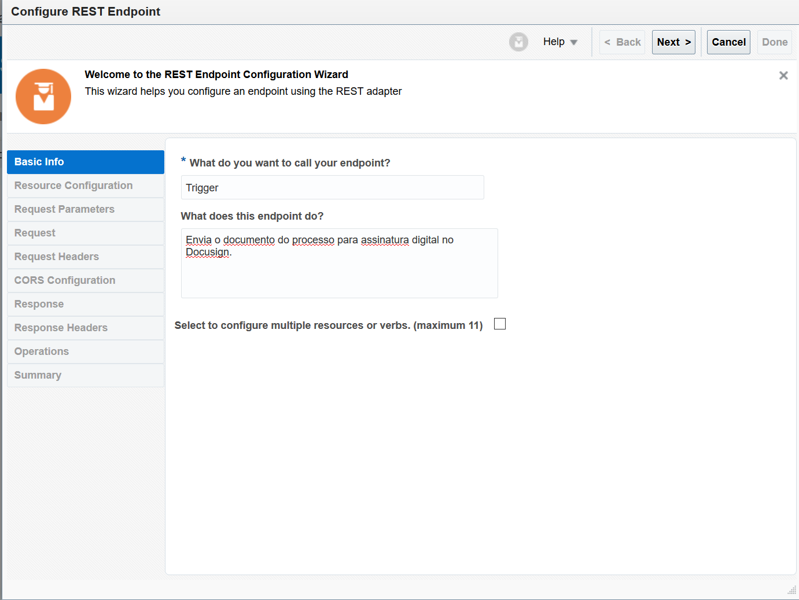
   
1. Preencher como na imagem abaixo e clicar em **Next**:

   
   
1. Agora vamos configurar nossa entrada de dados marcando as opções **Select the request payload format** e **What is the media-type or request body? (Content-Type Header)** com o valor **JSON Sample e JSON** respectivamente:

   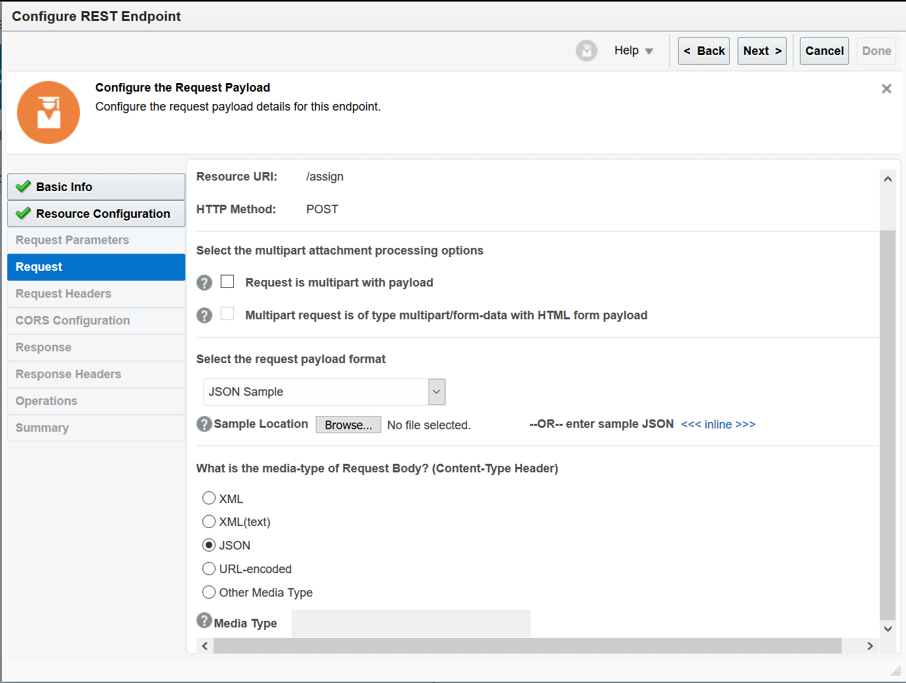
   
1. Clicar no **<<<< inline >>>>** para colocar um exemplo de entrada:

   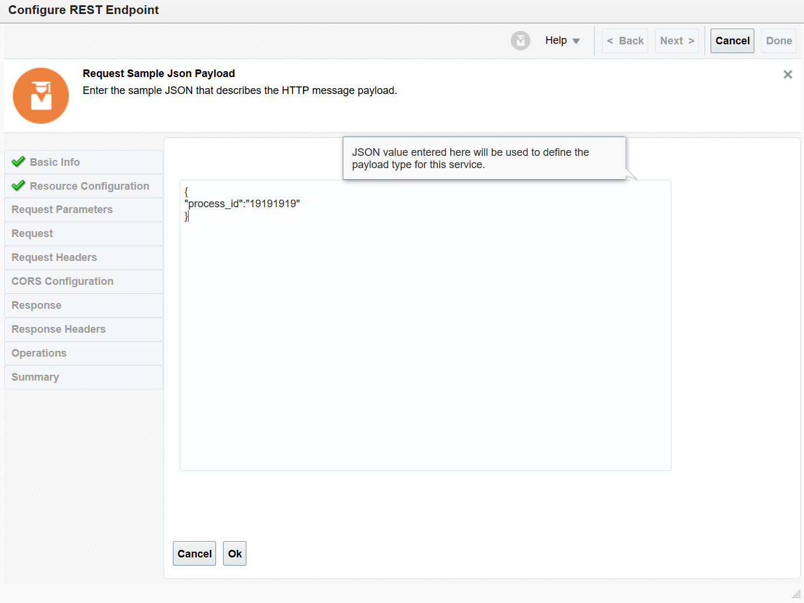
   
   Utilizar o valor no quadro abaixo e clicar em **Ok:**

|
{

"process\_id":"19191919"

}
|
| :- |
1. Clicar em **Next**;

   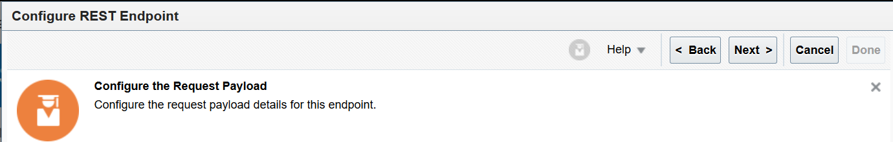
   
1. Agora vamos configurar a modelo de resposta que nossa API irá retornar;
1. Assim como fizemos no anterior iremos preencher como JSON Sample e JSON os campos **Select the request payload format** e **What is the media-type or request body? (Content-Type Header)**:

   
   
1. Clicar no **<<<< inline >>>>** para colcoar um exemplo de entrada;
1. Utilizar o valor no quadro abaixo e clicar em **Ok:**

|
{

"process\_id":"19191919"

}
|
| :- |

1. Clicar em **Next**;
1. Clicar em Done para concluir:

   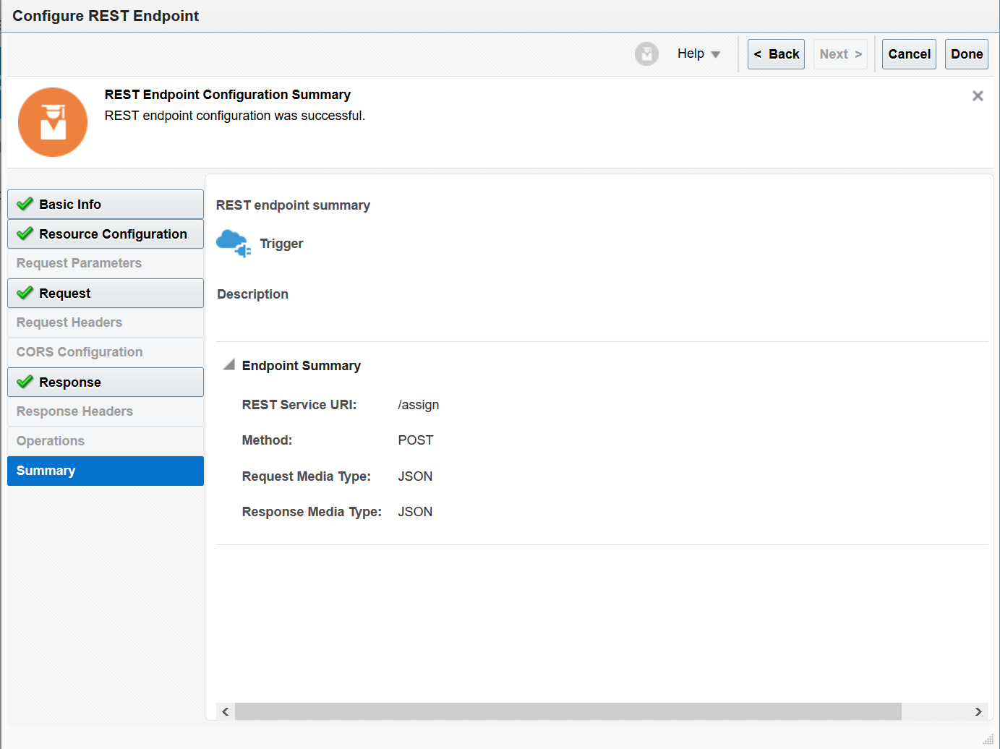
   
1. Neste ponto definimos as assinatura da nossa API e retorno da nossa API:

   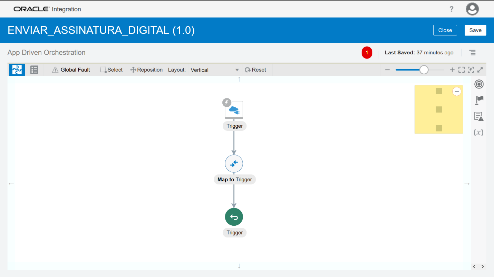
   
1. Clicar no ícone **menu** na extremidade direita;

   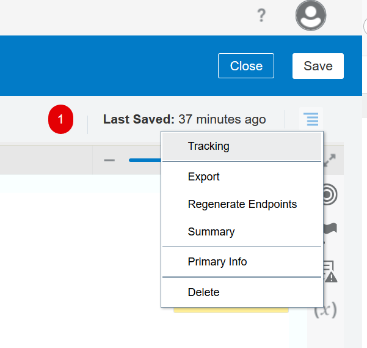
   
1. Clicar em Tracking;
1. Agora selecione **process\_id** e clique no icone seta, para inserirmos o process\_id como um tracking field: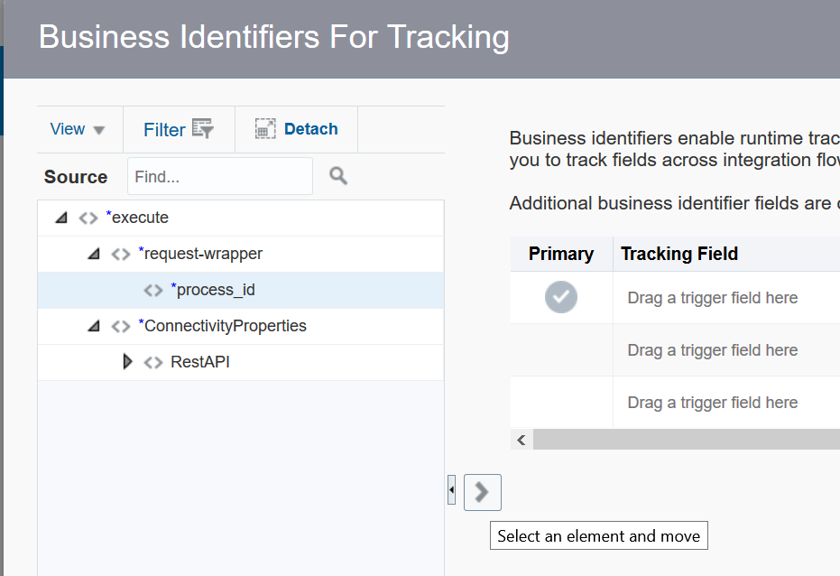
1. Clicar em **Save**;

   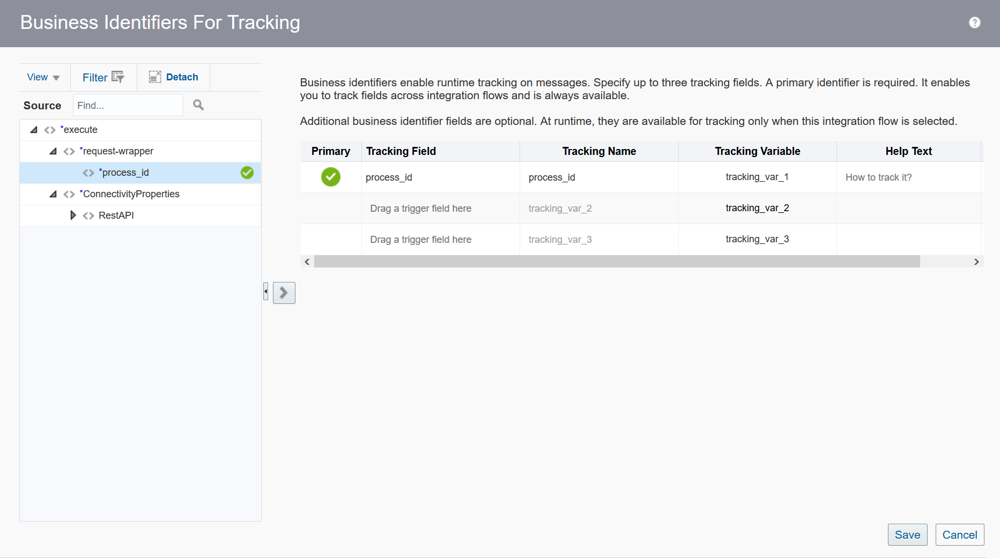
   
1. Feito isso a notificação em vermelho que aparecia como um erro em nossa integração irá sumir (caso não tenha visto o screenshot do passo 20 mostra isso):

   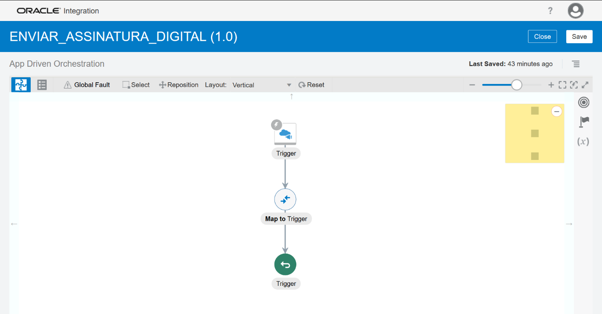
   
1. Fim

[Clique aqui para voltar a lista de labs](https://github.com/vhakamine/OIC_HANDS_ON/blob/main/README.md)
