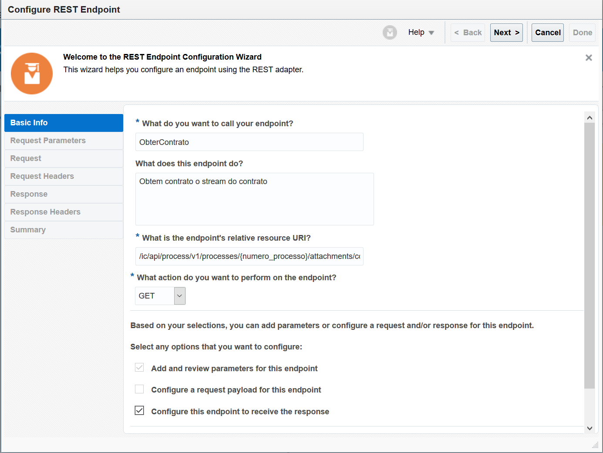
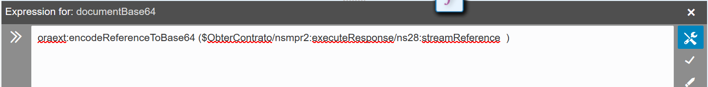

Lab07 – Adicionando mais inteligencia a integração:

1. Agora vamos configurar nossa integração para fazer chamada para a API que irá pegar o contrato baseado no nome do documento (utilizaremos o valor **contrato.pdf**) e também do numero do processo;
1. Clicar no ícone **Invokes** em seguida em **REST**:
1. Clicar em [MYNAME]\_PROCESS e arrastar para o fluxo entre os objetos **Tiggrer** e **Map;**
1. Preencher as informações conforme a imagem abaixo:
   
   **What do you call your endpoint?** ObterContrato
   **What does this endpoint do?** Obtem stream do contrato
   **What is the endpoint’s relative resource URI?** /ic/api/process/v1/processes/{numero\_processo}/attachments/contrato.pdf/stream
   **What action  do you want to perform on the endpoint?** GET
   Marcar a opção: **Configure this endpoint to receive the response.**
1. Clique em Next;
   
1. Configurar numero\_processo como string e clicar em **Next**;
1. Marcar as seguintes opções e clicar em **Next**:

1. Clique em **Done**;
   
1. Clique no objeto **Map to ObterContrato**, em seguida clique no icone lapís para editar o mapeamento:
1. Clique em Process Id e arraste até o Numero do Processo:
   
1. Clique em Validate e aguarde a mensagem de sucesso:
   
1. Clique em **Close;**
1. Agora que já nosso fluxo já está pegando o contrato do formulario de processo, nós vamos configurar o envio do contrato para integração de assinatura de documentos;
1. Clicar no ícone **Invoke** em seguida clicar em **DocuSign**:
   
1. Selecionar em Oracle DocuSign Connection e arrastar para o fluxo depois de objeto **ObterContrato**:
   
1. Vamos preencher as informações do formulário como a imagem abaixo, clicar em **Next**:
   
1. Selecionar a operação **Send an envelope or create a draft** e clicar em **Next**:
   
1. Será apresentado um resumo das configurações clicar em Done:
   
1. Clicar no objeto Map to EnviarContratoDocuSign
1. Clicar no ícone lapís;
1. Agora vamos mapear as informações;
1. Clicar no localizar o **accountid** dentro de **TemplateParameters** no **Target**;
   
1. Selecionar o accountid e clicar com o botão direito e selecionar a opção **Create Target Node**:
    
1. Preencher com o valor do account id que pegamos dentro do DocuSign na pagina de Apps e Keys, a imagem abaixo demonstra onde é possível obter o valor:
   
1. No meu caso ficou prenchido dessa maneira:
   
1. Clicar no ícone **check** para salvar o mapeamento:
   
1. Clicar no botão **Validate** para validar se o mapeamento está valido e aguardar a mensagem de sucesso:
   
1. Clicar no ícone lupa para pesquisar um campo na seção target:
   
1. Utilizar o valor **base64** e pressionar **enter**;
   
1. Agora que encontramos **documentBase64** vamos clicar em no icone seta ao lado de Functions para lista-las:
   
1. Vamos listar as funções dentro de Advanced clicando no ícone seta ao lado:
   
1. Agora vamos localizar a função **encodeReferenceToBase64**
   
1. Vamos arrastar **encodeReferenceToBase64** no **documentBase64** que encontramos anteriormente:
   
1. Clicar entre os parenteses na expressão:
   
1. Clicar em StreamReference e arrastar para dentro dos parenteses:
   
1. Teremos o seguinte resultado:
   
1. Clique no ícone check para salvar o mapeamento e em seguida clique em Validate, aguarde a mensagem de validação com sucesso;
   
1. Agora vamos fazer os seguintes mapeamentos com valor da mesma maneira que fizemos com o **accountid** nos passos anteriores sempre utilizar o valor dentro aspas duplas, por exemplo: “valor”;
1. Campo **name** dentro da estrutura **document** com o nome do documento:
   
1. Campo **documentid** dentro da estrutura **document**, com o valor do **numero\_processo**:
   
1. Campo **emailSubject**, titulo do E-mail para assinatura do contrato:
   
1. O campo **name** dentro da estrutura **signers** que está dentro da estrtura **recipients** que é o nome de quem vai assinar o contrato via DocuSign, preencher com o seu nome:
   
1. O campo **e-mail** dentro da estrutura **signers** que está dentro da estrtura **recipients,** que é o email de quem vai assinar o contrato via DocuSign, preencher com o seu e-mail:
   
1. O campo **recipientId** dentro da estrutura **signers** que está dentro da estrtura **recipients,** preencher com o valor **“1”**:
   
1. O campo **routingOrder** dentro da estrutura **signers** que está dentro da estrtura **recipients,** preencher com o valor **“1”**:
   
1. Clicar em Validate e receber a mensagem de sucesso;
   
1. O campo **status** que não está vinculado a nenhuma estrutura pai, popular com o valor **“sent”**:
   
1. Clique em **Validate** e em seguida **Close;**
1. Clicar no botão **Save** e receber a notificação de sucesso**:
   **
1. Clicar no botão **Close;**
1. Agora clicar no botão **Activate** para ativarmos nossa integração:
   
1. Marcar todas as opções conforme a imagem abaixo:
   
1. Clicar em Active;
1. Aguardar a confirmação de sucesso:
   
1. Fim.

[Clique aqui para voltar a lista de labs](https://github.com/vhakamine/OIC_HANDS_ON/blob/main/README.md)
