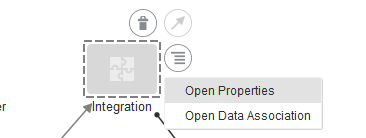
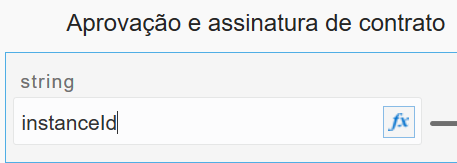

Lab08 – Adicionar a integração ao Processo

1. Clicar no menu hamburguer clique em voltar e depois e ir na opção **Processess:
   **
1. Em seguida clicar em **Process Application** e vamos clicar no nossa aplicação de processo **Application:
   **
1. Com a nossa aplicação aberta vamos clicar no menu hamburger e acessar a opção **Integrations**:
   
1. Clique em **Link to an Integration** e em seguida clique em **Browser available integrations**:
   
1. Na barra de busca iremos por **ENVIAR\_ASSINATURA\_DIGITAL**:
   
1. Clique na integração **ENVIAR\_ASSINATURA\_DIGITAL** e depois clicar no botão **Create**, teremos nossa integração listada:
   
1. Clicar no menu hamburguer e selecionar a opção Processes:
   
1. Clicar no nosso processo **Aplicação e assinatura de contrato**;
1. Clicar no objeto integration do fluxo de processo; 
   
1. Clicar no botão de **menu** e depois clicar em **Open Properties**:
   
1. Clicar na lista **Integration** e selecionar o valor **ENVIARASSINATURADIGITAL**:
   
1. Não esquecer de desmarcar a opção **Is Draft**, teremos o seguinte resultado:
   
1. Voltar ao processo e clicar no menu do objeto Integration e depois na opção Data Association:
   
1. Do lado esquerdo clique no instanceId e arraste para o campo New Association:
   
1. Clicar no ícone **fx**:
   
1. Preencher  a expressão com o valor:

|instanceId.substring(6)|
| :- |
1. Em seguida clique no botão **Validate**, para validar se a expressão é válida, aguarde a confirmação:
   
1. Vá para a parte inferior da página e clique em **Ok**:
   
1. Do lado direito vamos pegar o process\_id e arrastar para o campo correspondente que ficou livre:
   
1. Feito isso clicar no botão **Apply**:
1. Clicar no botão **Save**;
   
1. Clicar em **Publish**:
   
1. Inserir os comentarios da publica em **Comments** e depois Clicar novamente em Publish;
   
1. Agora clicar em Active:
   
1. Clique em **Active new version**:
   
1. Em **Select a snapshot** deixar como **Last Published Version**:
   
1. Clique no botão **Validate**;
1. Clique no botão **Options**:
   
1. Colocar um número de versão estou utilizando **0.5:
   **
1. Clicar no botão **Activate:**
1. **Aguardar a mensagem de sucesso:
   **
1. Clicar no botão **Finish;**
1. Clicar no botão **Close**:
   
1. Fim;
